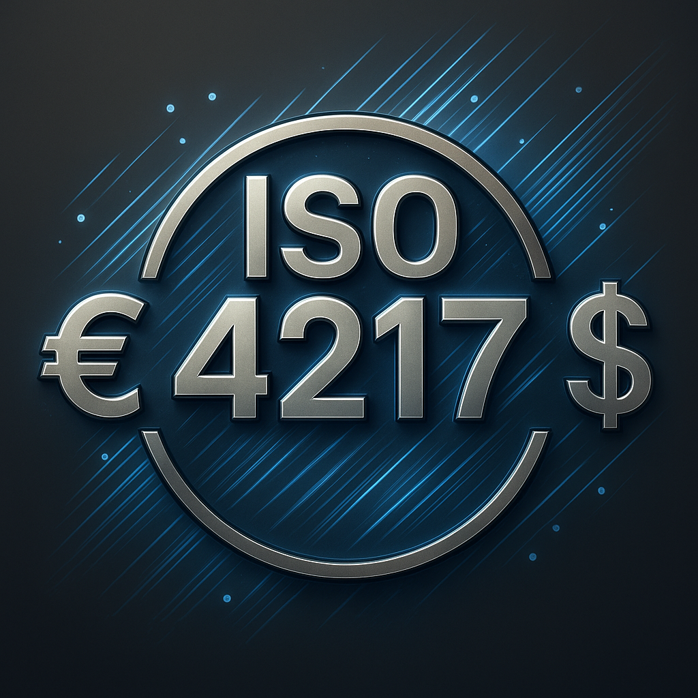

# HawkN.Iso.Currencies

[](https://github.com/HawkN113/HawkN.Iso.Currencies/actions/workflows/ci.yml)
[](https://github.com/HawkN113/HawkN.Iso.Currencies/actions/workflows/codeql-analysis.yml)
[](https://www.nuget.org/packages/HawkN.Iso.Currencies/)
[](https://www.nuget.org/packages/HawkN.Iso.Currencies/)
<br />
[](https://learn.microsoft.com/en-us/nuget/nuget-org/trusted-publishing)
[](https://dotnet.microsoft.com/download)
[](https://www.nuget.org/packages/HawkN.Iso.Currencies/)
[](LICENSE)
[](https://unicode.org/license.html)
[](https://opendatacommons.org/licenses/odbl/1-0/)


|  | **HawkN.Iso.Currencies** provides ISO 4217 currency codes, historical currency data, and replacement mappings. |
|--------------------------------------|--------------------------------------------------------------------------------------------------------------------------------------------------------------------------------------------------------------------------------------------------------------------------------------------------------------------------------------------------------------------------------------------------------------------------------------------------------------------------------------------------------------------------------------------------------------------------------------------------------------------------------------------------------------------|
---

## Features
- **Actual currency list** - Provides a complete and up-to-date set of currency codes and their details according to the `ISO 4217` standard.
- **Strongly typed currency codes** – `CurrencyCode` enum is generated at compile-time.
- **Historical currency support** – Access withdrawn currencies.
- **Lightweight & Dependency-Free** – Minimal overhead, compatible with .NET 8 and above.
- **Integration ready** – Use in libraries, console apps, or web applications.

---

## Packages

| Package                                                                                           | Description |
|---------------------------------------------------------------------------------------------------|-------------|
| [](https://www.nuget.org/packages/HawkN.Iso.Currencies/) | Main library with domain models, currency utilities, and generated `CurrencyCode` type. |
---

## Getting Started

### Install via NuGet

```bash
dotnet add package HawkN.Iso.Currencies
```
---

### Required Namespaces
```csharp
using HawkN.Iso.Currencies;
using HawkN.Iso.Currencies.Abstractions;
using HawkN.Iso.Currencies.Models;
using HawkN.Iso.Currencies.Extensions;
```
---

### Usage Example

#### Registration
Use extension method `.AddCurrencyService();`
```csharp
using var host = Host.CreateDefaultBuilder(args)
    .ConfigureServices(services =>
    {
        services.AddCurrencyService();
    })
    .Build();
```
To get service instance:
```csharp
var currencyService = scope.ServiceProvider.GetRequiredService<ICurrencyService>();
```
or inject
```csharp
app.MapGet("/weatherforecast", ([FromServices] ICurrencyService currencyService) => ...
````

#### Get all existing currencies
```csharp
var currencyService = scope.ServiceProvider.GetRequiredService<ICurrencyService>();
var currencies = currencyService?.Query()
    .Includes
        .Type(CurrencyType.Fiat)
        .Type(CurrencyType.SpecialUnit)
        .Type(CurrencyType.SpecialReserve)
        .Type(CurrencyType.PreciousMetal)
   .Build();
```

#### Get fiat currencies
```csharp
var currencyService = scope.ServiceProvider.GetRequiredService<ICurrencyService>();
var currencies = currencyService?.Query()
   .Includes
        .Type(CurrencyType.Fiat)
   .Build();
```

#### Get currencies by query
Excludes `EUR` and `USD` from the list:
```csharp
var currencies = currencyService?.Query()
   .Includes
        .Type(CurrencyType.Fiat)
   .Without(w => w.Codes(nameof(CurrencyCode.EUR), nameof(CurrencyCode.USD)))
   .Build();
```

Includes only `EUR` and `USD` in the list:
```csharp
var currencies = currencyService?.Query()
   .Includes
        .Type(CurrencyType.Fiat)
   .With(w => w.Codes("EUR", "usd"))
   .Build();
```

#### Get currencies by advanced query (LINQ)
Includes only `EUR` and `USD` in the list:
```csharp
var currencies = currencyService?.Query()
   .Includes
        .Type(CurrencyType.Fiat)
   .Where(q => q.Code is "EUR" or nameof(CurrencyCode.USD))
   .Build();
```

#### Get historical currencies
```csharp
var historical = currencyService.GetAllHistorical();
foreach (var currency in historical)
{
    Console.WriteLine($"{currency.Code} - {currency.Name} (Withdrawn: {currency.WithdrawnOn})");
}
```

#### Lookup currency
By string code
```csharp
var afnWithString = currencyService.Get("AFN");
```
By currency code
```csharp
var afnWithCode = currencyService.Get(CurrencyCode.AFN);
```

#### Validate currency
By string code
```csharp
var validResult = currencyService.TryValidate("AFN", out var validateResult);
```
By currency code
```csharp
var validResult = currencyService.TryValidate(CurrencyCode.AFN, out var validateResult);
```
---

## Supported currencies
<details>
<summary>Click to view the full list of supported fiat currencies</summary>

| Currency code  | Currency name                            |
|:---------------:|:-----------------------------------------:|
| AED            | UAE Dirham                               |
| AFN            | Afghani                               |
| ALL            | Albanian Lek                               |
| AMD            | Armenian Dram                               |
| AOA            | Angolan Kwanza                               |
| ARS            | Argentine Peso                               |
| AUD            | Australian Dollar                               |
| AWG            | Aruban Florin                               |
| AZN            | Azerbaijan Manat                               |
| BAM            | Convertible Mark                               |
| BBD            | Barbados Dollar                               |
| BDT            | Bangladeshi Taka                               |
| BHD            | Bahraini Dinar                               |
| BIF            | Burundian Franc                               |
| BMD            | Bermudian Dollar                               |
| BND            | Brunei Dollar                               |
| BOB            | Bolivian Boliviano                               |
| BOV            | Bolivian Mvdol                               |
| BRL            | Brazilian Real                               |
| BSD            | Bahamian Dollar                               |
| BTN            | Bhutanese Ngultrum                               |
| BWP            | Botswana Pula                               |
| BYN            | Belarusian Ruble                               |
| BZD            | Belize Dollar                               |
| CAD            | Canadian Dollar                               |
| CDF            | Congolese Franc                               |
| CHE            | WIR Euro                               |
| CHF            | Swiss Franc                               |
| CHW            | WIR Franc                               |
| CLF            | Unidad de Fomento                               |
| CLP            | Chilean Peso                               |
| CNY            | Chinese Yuan                               |
| COP            | Colombian Peso                               |
| COU            | Unidad de Valor Real                               |
| CRC            | Costa Rican Colón                               |
| CUP            | Cuban Peso                               |
| CVE            | Cape Verde Escudo                               |
| CZK            | Czech Koruna                               |
| DJF            | Djiboutian Franc                               |
| DKK            | Danish Krone                               |
| DOP            | Dominican Peso                               |
| DZD            | Algerian Dinar                               |
| EGP            | Egyptian Pound                               |
| ERN            | Eritrean Nakfa                               |
| ETB            | Ethiopian Birr                               |
| EUR            | Euro                               |
| FJD            | Fiji Dollar                               |
| FKP            | Falkland Islands Pound                               |
| GBP            | British Pound                               |
| GEL            | Georgian Lari                               |
| GHS            | Ghanaian Cedi                               |
| GIP            | Gibraltar Pound                               |
| GMD            | Gambian Dalasi                               |
| GNF            | Guinean Franc                               |
| GTQ            | Guatemalan Quetzal                               |
| GYD            | Guyanese Dollar                               |
| HKD            | Hong Kong Dollar                               |
| HNL            | Honduran Lempira                               |
| HTG            | Haitian Gourde                               |
| HUF            | Hungarian Forint                               |
| IDR            | Indonesian Rupiah                               |
| ILS            | Israeli New Shekel                               |
| INR            | Indian Rupee                               |
| IQD            | Iraqi Dinar                               |
| IRR            | Iranian Rial                               |
| ISK            | Icelandic Krona                               |
| JMD            | Jamaican Dollar                               |
| JOD            | Jordanian Dinar                               |
| JPY            | Japanese Yen                               |
| KES            | Kenyan Shilling                               |
| KGS            | Kyrgyzstani Som                               |
| KHR            | Cambodian Riel                               |
| KMF            | Comorian Franc                               |
| KPW            | North Korean Won                               |
| KRW            | South Korean Won                               |
| KWD            | Kuwaiti Dinar                               |
| KYD            | Cayman Islands Dollar                               |
| KZT            | Kazakhstani Tenge                               |
| LAK            | Lao Kip                               |
| LBP            | Lebanese Pound                               |
| LKR            | Sri Lankan Rupee                               |
| LRD            | Liberian Dollar                               |
| LSL            | Lesotho Loti                               |
| LYD            | Libyan Dinar                               |
| MAD            | Moroccan Dirham                               |
| MDL            | Moldovan Leu                               |
| MGA            | Malagasy Ariary                               |
| MKD            | Macedonian Denar                               |
| MMK            | Myanmar Kyat                               |
| MNT            | Mongolian Tugrik                               |
| MOP            | Macanese Pataca                               |
| MRU            | Mauritanian Ouguiya                               |
| MUR            | Mauritian Rupee                               |
| MVR            | Maldivian Rufiyaa                               |
| MWK            | Malawian Kwacha                               |
| MXN            | Mexican Peso                               |
| MXV            | Mexican Investment Unit                               |
| MYR            | Malaysian Ringgit                               |
| MZN            | Mozambican Metical                               |
| NAD            | Namibian Dollar                               |
| NGN            | Nigerian Naira                               |
| NIO            | Nicaraguan Córdoba                               |
| NOK            | Norwegian Krone                               |
| NPR            | Nepalese Rupee                               |
| NZD            | New Zealand Dollar                               |
| OMR            | Omani Rial                               |
| PAB            | Panamanian Balboa                               |
| PEN            | Peruvian Sol                               |
| PGK            | Papua New Guinean Kina                               |
| PHP            | Philippine Peso                               |
| PKR            | Pakistani Rupee                               |
| PLN            | Polish Zloty                               |
| PYG            | Paraguayan Guarani                               |
| QAR            | Qatari Riyal                               |
| RON            | Romanian Leu                               |
| RSD            | Serbian Dinar                               |
| RUB            | Russian Ruble                               |
| RWF            | Rwandan Franc                               |
| SAR            | Saudi Riyal                               |
| SBD            | Solomon Islands Dollar                               |
| SCR            | Seychelles Rupee                               |
| SDG            | Sudanese Pound                               |
| SEK            | Swedish Krona                               |
| SGD            | Singapore Dollar                               |
| SHP            | Saint Helena Pound                               |
| SLE            | Sierra Leonean Leone                               |
| SOS            | Somali Shilling                               |
| SRD            | Surinamese Dollar                               |
| SSP            | South Sudanese Pound                               |
| STN            | São Tomé and Príncipe Dobra                               |
| SYP            | Syrian Pound                               |
| SZL            | Swazi Lilangeni                               |
| THB            | Thai Baht                               |
| TJS            | Tajikistani Somoni                               |
| TMT            | Turkmenistani Manat                               |
| TND            | Tunisian Dinar                               |
| TOP            | Tongan Pa?anga                               |
| TRY            | Turkish Lira                               |
| TTD            | Trinidad and Tobago Dollar                               |
| TWD            | New Taiwan Dollar                               |
| TZS            | Tanzanian Shilling                               |
| UAH            | Ukrainian Hryvnia                               |
| UGX            | Ugandan Shilling                               |
| USD            | US Dollar                               |
| USN            | US Dollar (Next day)                               |
| UYI            | Uruguayan Peso (Indexed Units)                               |
| UYU            | Uruguayan Peso                               |
| UYW            | Unidad Previsional                               |
| UZS            | Uzbekistani Som                               |
| VES            | Venezuelan Bolívar                               |
| VND            | Vietnamese Dong                               |
| VUV            | Vanuatu Vatu                               |
| WST            | Samoan Tala                               |
| XAF            | Central African CFA Franc                               |
| XAG            | Silver (one troy ounce)                               |
| XAU            | Gold (one troy ounce)                               |
| XBA            | European Composite Unit                               |
| XBB            | European Monetary Unit                               |
| XBC            | European Unit of Account (XBC)                               |
| XBD            | European Unit of Account (XBD)                               |
| XCD            | East Caribbean Dollar                               |
| XDR            | Special Drawing Rights                               |
| XOF            | West African CFA Franc                               |
| XPD            | Palladium (one troy ounce)                               |
| XPF            | CFP Franc                               |
| XPT            | Platinum (one troy ounce)                               |
| XSU            | Sucre (Unidad de Cuenta del ALBA)                               |
| XTS            | Testing Currency Code                               |
| XUA            | ADB Unit of Account                               |
| XXX            | Unknown Currency                               |
| YER            | Yemeni Rial                               |
| ZAR            | South African Rand                               |
| ZMW            | Zambian Kwacha                               |

</details>

---

## Generated Types
- `CurrencyCode` – strongly-typed enum with all ISO 4217 codes.
- `Currency` – domain model representing a currency (code, name, numeric code, withdrawn date).

---

## License

### Code
This project’s source code is licensed under the [MIT License](LICENSE).

### Data
This project uses data derived from the following sources:

- **Unicode Common Locale Data Repository (CLDR)**  
  Licensed under the [Unicode License Agreement](https://unicode.org/license.html).

- **ISO 4217 currency codes dataset**  
  Source: https://github.com/datasets/currency-codes  
  Licensed under the **Open Database License (ODbL) v1.0**.

The above data licenses are **permissive and compatible with MIT-licensed code**  
when used for reference and code generation.

See [DATA-LICENSE](DATA-LICENSE) for details.

---

## References
- [ISO 4217 Standard](https://www.iso.org/iso-4217-currency-codes.html)
- [GitHub Repository](https://github.com/HawkN113/HawkN.Iso.Currencies)

